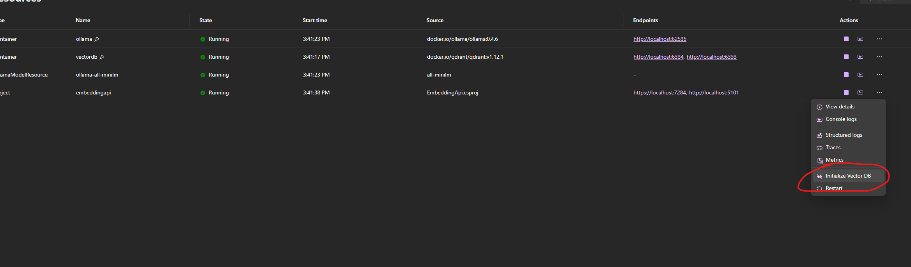

# Aspire Assistant VSCode Extension

## Description

This repository contains a .NET Aspire application that orchestrates a web API and a few container resources, as well as one TypeScript project that implements a VS Code extension. The extension adds a GitHub Copilot chat participant which can help users write .NET Aspire applications by having specific knowledge and understanding of .NET Aspire overall.

## Getting Started

### Prerequisites

- .NET 9.0 SDK
- Node.js
- Visual Studio Code 1.95.0 or higher
- Ensure GitHub Copilot Chat is installed in Visual Studio Code

### Installation

1. Clone the repository.
2. Run the Aspire application by running the command below in the root directory of the repository:

   ```sh
   dotnet run --project AspireAppBuilding.AppHost
   ```

3. Navigate to the `VSCodeAIExtension` directory and install the dependencies by running the command below:

   ```sh
   npm install
   ```

4. Open the `VSCodeAIExtension` directory in Visual Studio Code and run the extension by pressing `F5`.

## Usage

1. The first time you run the Aspire application, you will need to initialize the Vector database that is used by the Embedding API. You can do that from the Aspire Dashboard by clicking on the `...` Actions for the embeddingapi project, and then clicking on the `Initialize Vector DB` menu item. Failing to do so will result in an error when you try to use the Embedding API.
   
2. Once you press F5, a new instance of Visual Studio Code will open with the extension running.
3. Open GitHub Copilot Chat in the new instance of VS Code (Ctrl + Alt + I), and invoke the chat participant by typing `@crush`.
4. You should now be able to chat with the GitHub Copilot chat participant and ask questions about .NET Aspire.

## Contributing

Contributions are welcome! Please open an issue or submit a pull request.

## Projects

### AspireAppBuilding.AppHost

This project is the main application host that orchestrates various container resources and services.

### AspireAppBuilding.ServiceDefaults

This project provides common .NET Aspire services such as service discovery, resilience, health checks, and OpenTelemetry.

### EmbeddingApi

This project implements a web API that provides embedding generation and vector database operations.

### VSCodeAIExtension

This project implements a VS Code extension that adds a GitHub Copilot chat participant to assist users with .NET Aspire applications.

## License

This project is licensed under the MIT License.
